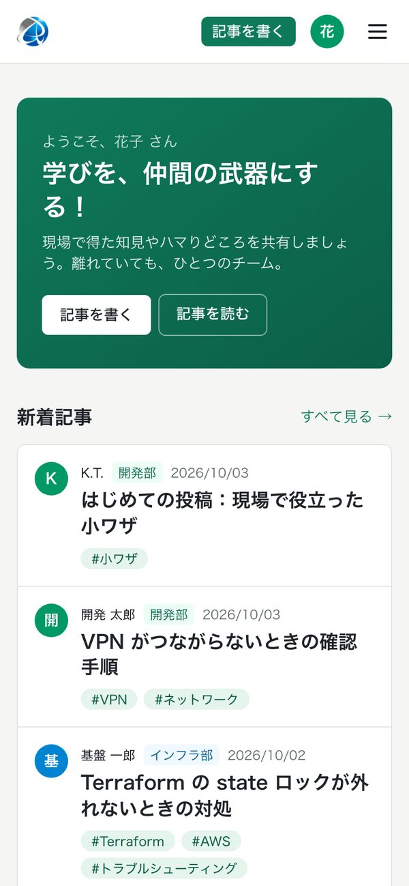
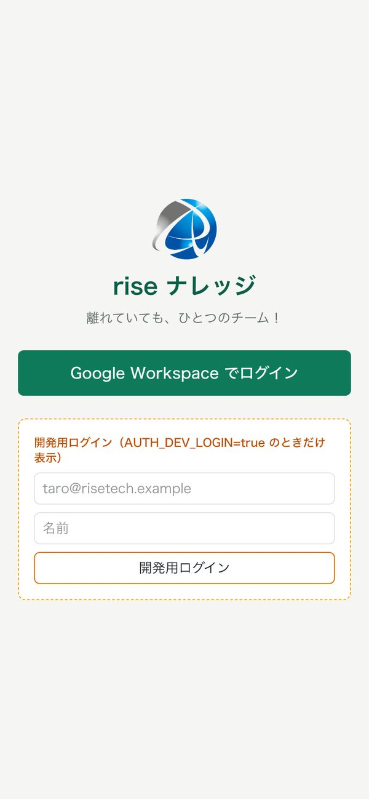
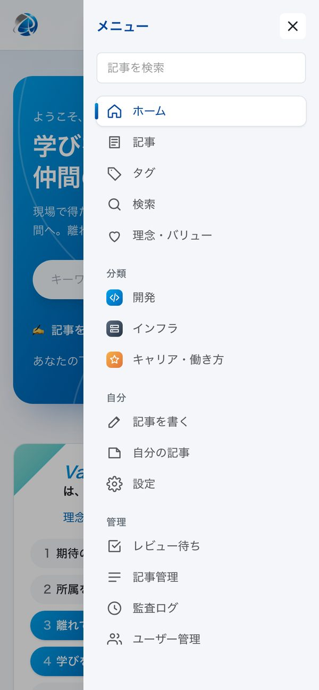
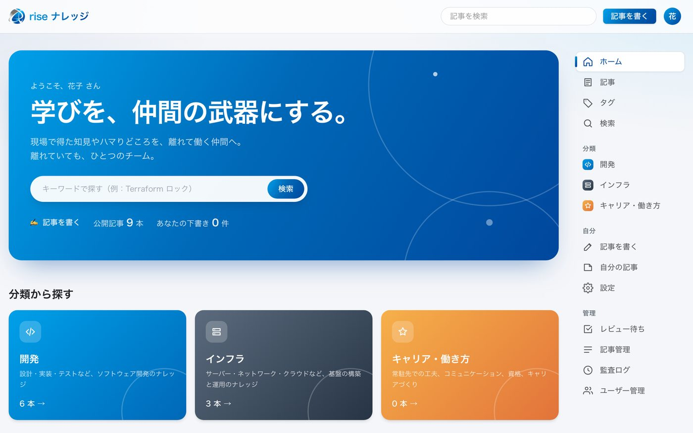
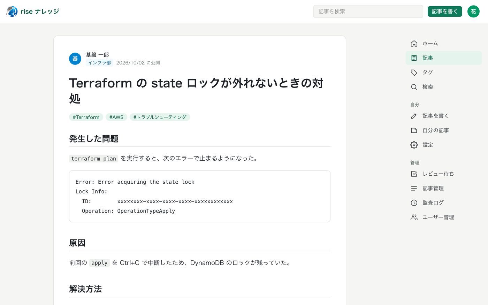
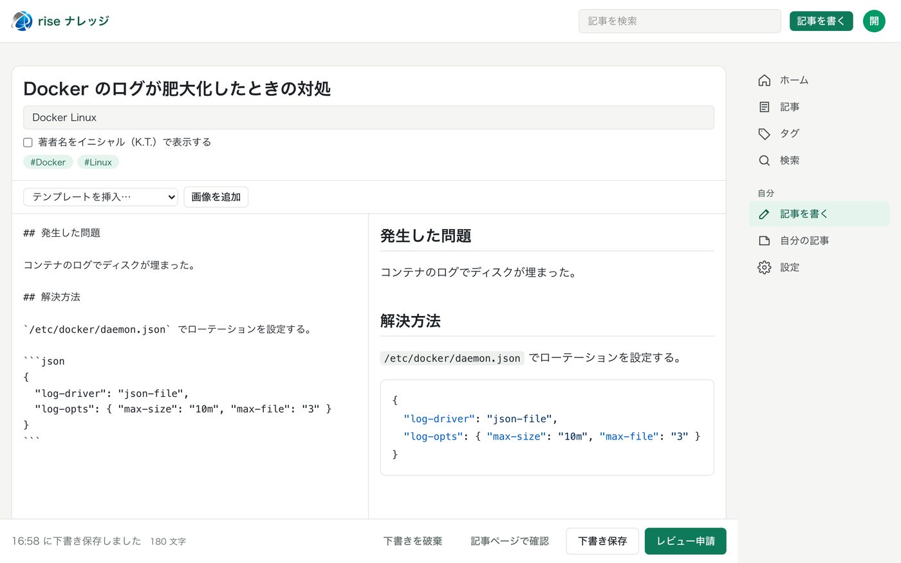
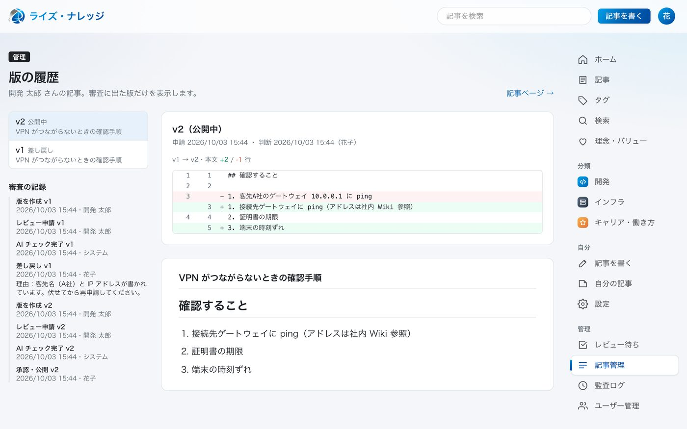

# ライズ・ナレッジ

rise tech solutions 社内ナレッジ共有サイト（社内限定）。
「離れていても、ひとつのチーム！」「学びを、仲間の武器にする！」を実現するための、Qiita のような記事共有サイトです。

**▶ 操作デモ：https://yukis01060106.github.io/rise-knowledge/**
（スマホでも OK。記事を書く → レビュー申請 → 管理者に切り替えて承認、まで試せます。データは架空で、開いたブラウザの中だけに保存されます）

> このリポジトリはソースコードです。サイト本体は社内ネットワークでだけ動かします。
> 操作デモ（`demo/`）は見た目と操作を体験するための別物で、本物のサイトにはつながっていません。
> 下の画面は開発環境のもので、人名・記事はすべて架空のデータです。

## 画面

| トップ | ログイン | メニュー |
|:---:|:---:|:---:|
|  |  |  |

**トップ（PC）** — ロゴの青を基調に。分類から探す、新着記事、人気のタグ。メニューは右側



**記事** — Markdown、コードのハイライト、タグ



**記事を書く** — 左で入力、右でプレビュー。大分類と属性の選択、自動で下書き保存、画像の貼り付け、イニシャル表示での投稿



**承認フロー（管理者）** — 公開前にかならず管理者が確認。差し戻しの理由・版ごとの差分・審査の記録が残る



## 主な機能

- 記事の投稿（Markdown・テンプレート・画像・タグ・自動保存）、日本語全文検索
- 分類：大分類（開発 / インフラ / キャリア・働き方）＋ 軸ごとの属性（工程・言語・製品など）＋ 自由タグ。
  軸をかけ合わせて絞り込める（[docs/design/taxonomy.md](docs/design/taxonomy.md)）
- 承認フロー：下書き → AI チェック → 管理者の確認 → 公開。自分の記事は承認できない。AI が自動で公開することはない
- 公開後に編集しても、新しい版が承認されるまでは公開中の内容を表示し続ける
- イニシャル表示での投稿（ほかの社員には実名を出さない）
- AI チェック：申請時の事前スキャン（パスワード・API キー等で申請を止める）と Claude による審査。リスク高は自動差し戻し
- いいね・ストック・コメント（コメントも AI チェック）、タグのフォロー、ユーザーページ
- 通知（サイト内・Slack）、月間ランキング、月間ベストの表彰、管理者ダッシュボード
- 監査ログ（追記のみ。変更・削除できない）、緊急非公開

## ドキュメント

| 読む人 | ドキュメント |
|---|---|
| 記事を書く人 | [投稿ガイドライン](docs/posting-guideline.md) |
| 管理者 | [管理者ガイド](docs/admin-guide.md) |
| サーバーの担当者 | [本番環境の構築と運用](docs/deploy.md) |
| 開発者 | [CLAUDE.md](CLAUDE.md)（開発ルール）、[設計書](docs/design/)、[セキュリティ点検の結果](docs/security-review.md) |

- 設計：[docs/design/](docs/design/)
- 開発ルール・コマンド：[CLAUDE.md](CLAUDE.md)

## 開発環境の立ち上げ（簡易版。フェーズ7で詳しく書く）

```
cp .env.example .env    # AUTH_SECRET を生成し、AUTH_ALLOWED_DOMAINS などを設定
docker compose up -d db
npm install
npx prisma migrate deploy
npm run db:seed:dev     # 動作確認用の架空ユーザーと公開記事（開発用 DB のみ）
npm run dev             # http://localhost:3000
npm run worker          # ジョブのワーカー（COMPLIANCE_RUNNER=queue のとき）
npm test                # 単体・結合テスト（.env.test のテスト用 DB）
npm run test:e2e        # E2E テスト（ブラウザで操作。テスト用 DB を使う）
```

DB は pg_bigm（日本語全文検索）が必要です。compose の db はビルド時に入れます。
Docker を使わずローカルの PostgreSQL 16（Homebrew）を使う場合は、一度だけ次でビルドして入れてください。

```
git clone --depth 1 https://github.com/pgbigm/pg_bigm.git /tmp/pg_bigm
make -C /tmp/pg_bigm USE_PGXS=1 PG_CONFIG=$(brew --prefix postgresql@16)/bin/pg_config install
```

画像は、開発では `STORAGE_DRIVER="local"`（`.data/uploads` に保存）で動きます。
compose で app を動かす場合は MinIO（S3 互換）に保存します。

SSO の設定がまだない場合は、`.env` で `AUTH_DEV_LOGIN="true"` にするとログイン画面に開発用ログインが出ます。
最初の管理者は、一度ログインしてから `npm run admin:grant -- <メールアドレス>` で登録します。
