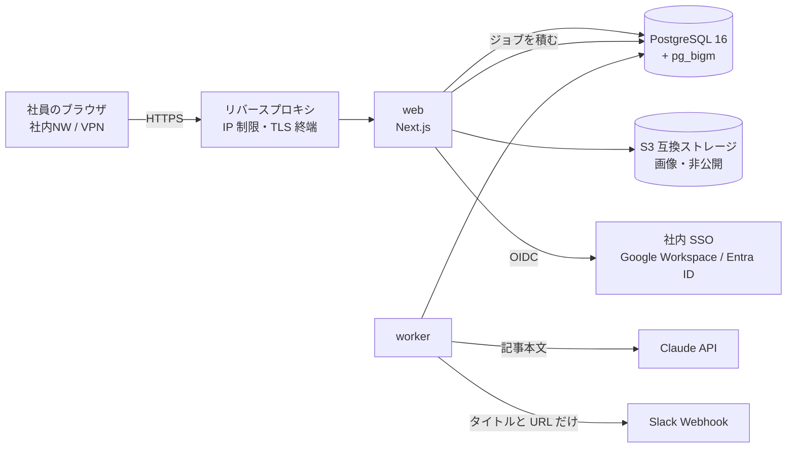

# 本番環境の構築と運用（ライズ・ナレッジ）

対象：社内でサーバーを用意・運用する担当者。

## 1. 構成



- **社内限定**：リバースプロキシで社内ネットワークと VPN からのアクセスだけを許可する。アプリもログイン必須だが、
  ネットワークでも閉じる（二重の防御）
- web と worker は同じリポジトリから作る別のイメージ（`docker/app/Dockerfile` の `web` / `worker` ターゲット）
- 外向きの通信は Claude API（`api.anthropic.com`）、Slack（`hooks.slack.com`）、SSO、S3 だけ

## 2. 用意するもの

| もの | 内容 |
|---|---|
| PostgreSQL 16 | `pg_bigm` 拡張が使えること（AWS RDS・Cloud SQL・自前構築のいずれか）。DB のオーナー用とアプリ用の 2 つのロール |
| S3 互換ストレージ | 画像用のバケット。**公開設定にしない**（画像はアプリ経由で配信する） |
| SSO | Google Workspace か Microsoft Entra ID の OIDC クライアント。リダイレクト URI は `https://<ドメイン>/api/auth/callback/<google または microsoft-entra-id>` |
| Claude API キー | AI チェック用。社内のアカウントで発行する |
| Slack Incoming Webhook | 任意。通知用のチャンネル |
| TLS 証明書 | 社内ドメイン用 |

## 3. 環境変数

値は秘密情報の管理の仕組み（Secrets Manager など）から渡し、イメージ・リポジトリには書かない。

| 変数 | web | worker | 内容 |
|---|:-:|:-:|---|
| `DATABASE_URL` | ○ | ○ | **アプリ用ロール**（app_user）での接続文字列 |
| `AUTH_SECRET` | ○ | | `openssl rand -base64 32` で作る |
| `AUTH_URL` | ○ | | 本番の URL（例：`https://knowledge.example.co.jp`） |
| `AUTH_PROVIDER` | ○ | | `google` または `microsoft-entra-id` |
| `AUTH_ALLOWED_DOMAINS` | ○ | | ログインを許可するメールのドメイン（カンマ区切り） |
| `AUTH_GOOGLE_ID` / `AUTH_GOOGLE_SECRET` | ○ | | Google の場合 |
| `AUTH_MICROSOFT_ENTRA_ID_ID` / `_SECRET` / `_ISSUER` | ○ | | Entra ID の場合。ISSUER は自社テナント ID を含めること |
| `AUTH_DEV_LOGIN` | ○ | | **本番では `false`**（`true` だと起動しない） |
| `STORAGE_DRIVER` | ○ | | 本番は `s3`（`local` だと起動しない） |
| `S3_BUCKET` / `S3_REGION` / `S3_ENDPOINT` / `S3_ACCESS_KEY_ID` / `S3_SECRET_ACCESS_KEY` / `S3_FORCE_PATH_STYLE` | ○ | | AWS の IAM ロールを使うならキーは不要 |
| `ANTHROPIC_API_KEY` | | ○ | 未設定なら AI チェックは「未実施」として管理者の確認に回る |
| `COMPLIANCE_RUNNER` | ○ | ○ | 本番は `queue`（既定） |
| `SLACK_WEBHOOK_URL` | ○ | ○ | 任意。`https://hooks.slack.com/` で始まる URL のみ有効 |
| `APP_BASE_URL` | ○ | ○ | 通知に入れる URL の先頭 |

AI チェックのモデル名・しきい値は `config/compliance.ts`、プロンプトは `prompts/compliance_check.md`（変えたら
`promptVersion` を上げる）。

## 4. 初回の構築

1. DB を作り、オーナーのロールで pg_bigm を使えるようにする（マネージド DB ではパラメーターグループ等で許可が必要な場合がある）
2. マイグレーションを流す（**オーナーのロール**で）
   ```
   docker run --rm -e DATABASE_URL="$OWNER_DATABASE_URL" rise-knowledge-migrate
   ```
3. アプリ用ロールを作る（パスワードは秘密情報の管理の仕組みから渡す）
   ```
   psql "$OWNER_DATABASE_URL" -v app_role=app_user -v app_password="$APP_DB_PASSWORD" -f scripts/sql/app-role.sql
   ```
   - 監査ログ（`audit_logs`）は app_user から UPDATE / DELETE / TRUNCATE できなくなる（トリガーと二重の防御）
   - ジョブキューのスキーマ `pgboss` は app_user の持ち物として作られる
4. web と worker を起動する（`DATABASE_URL` は app_user）
5. 最初の管理者を登録する：登録したい人に一度ログインしてもらい、DB に直接つなげる担当者が実行する
   ```
   docker run --rm -e DATABASE_URL="$OWNER_DATABASE_URL" rise-knowledge-worker npm run admin:grant -- someone@example.co.jp
   ```
   2 人目以降の管理者は、管理画面の「ユーザー管理」から昇格する（自分の記事は自分で承認できないので、管理者は 2 人以上にする）

## 5. 更新（デプロイ）

1. 新しいイメージを作る（`web` / `worker` / `migrate`）
2. マイグレーションを流す（オーナーで）。新しいテーブルにも `ALTER DEFAULT PRIVILEGES` で app_user の権限が付く
3. worker → web の順に入れ替える
4. 動作確認：ログイン、記事の表示、レビュー申請（AI チェックが動くこと）、管理画面

マイグレーションは前に進めるだけにする。DB を消すコマンド（`prisma migrate reset` など）は本番で使わない。

## 6. 運用

- **バックアップ**：PostgreSQL は毎日のスナップショット＋ポイントインタイムリカバリ（7〜30 日）。S3 はバージョニングを有効にする。
  月に 1 回、別環境への復元を試す
- **監視**：web の `/login` が 200 を返すこと、worker のプロセスが動いていること、`compliance_checks` の
  `failed` が急に増えていないこと（Claude API の障害・キーの期限切れ）、レビュー待ちが溜まっていないこと
- **ログ**：アプリのログには ID・件数・所要時間・エラーコードだけを出す。記事本文・コメント・LLM の入出力・
  トークン・メールアドレス以外の個人情報は出さない
- **レート制限**：アプリのプロセスの中で数えている（`src/server/rate-limit.ts`）。web を複数台にする場合は、
  リバースプロキシでも同様の制限をかけるか、同じ人のリクエストを同じ台に寄せる
- **退職・異動**：管理画面の「ユーザー管理」で無効化すると、その場でログアウトさせられる。SSO 側のアカウントも止める
- **ワーカーが止まっていた場合**：再起動時に、審査の記録がない「AI チェック中」の版を自動で拾い直す

## 7. 開発環境との違い

| 項目 | 開発 | 本番 |
|---|---|---|
| ログイン | 開発用ログイン（`AUTH_DEV_LOGIN=true`）可 | SSO のみ |
| 画像 | ローカルディスク（`STORAGE_DRIVER=local`）可 | S3 互換のみ |
| AI チェック | `COMPLIANCE_RUNNER=inline`（その場で実行） | `queue`（ワーカー） |
| DB ロール | 1 つでよい | オーナーと app_user を分ける |
