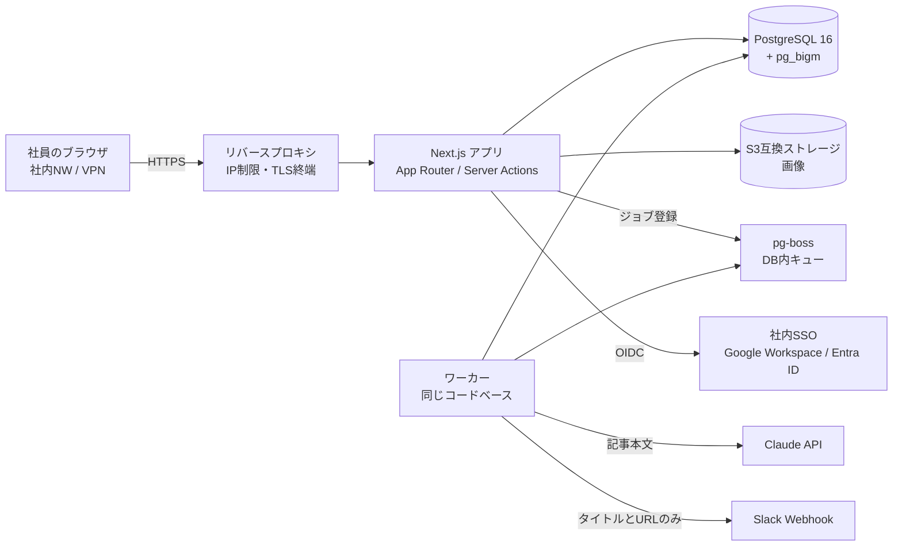

# 技術スタックの最終案と選定理由

## 構成図

## 採用技術と理由

| 領域 | 採用 | 理由 | 検討した代替案 |
|---|---|---|---|
| フレームワーク | Next.js（App Router）+ TypeScript | 画面と API を 1 つのコードベースにまとめられ、少人数でも保守しやすい。Server Actions で権限チェックをサーバーに集めやすい | Remix、Rails（チームの経験に合わせて選んでもよい） |
| DB | PostgreSQL 16 | トランザクション、行ロック、部分インデックス、JSONB が使え、状態遷移と監査ログに向く | MySQL |
| ORM | Prisma | 型安全。マイグレーションが分かりやすい | Drizzle（生 SQL に近い書き味が必要なら） |
| 日本語検索 | **pg_bigm**（2-gram 全文検索） | 形態素辞書なしで日本語の部分一致が速い。`LIKE '%語%'` をそのままインデックスで高速化でき、Prisma からも扱いやすい。AWS RDS / Cloud SQL でも利用可能 | PGroonga（高機能だがマネージド DB で使えないことが多い）、Elasticsearch / OpenSearch（数千記事規模では運用負荷に見合わない） |
| 認証 | Auth.js v5 + OIDC | Google / Entra ID の両方に対応。`signIn` コールバックで許可ドメインを判定できる。DB セッションにすればサーバー側から即時失効できる | 自前実装（しない） |
| 画像 | S3 互換（本番は S3 等、開発は MinIO） | アプリサーバーをステートレスに保てる。画像は署名付き URL ではなく **アプリ経由で配信**し、ログイン確認をかける（社外から URL を知られても見えないように） | DB の bytea（バックアップが肥大化する） |
| 非同期処理 | pg-boss | AI チェックは数秒〜数十秒かかり、再試行も必要。PostgreSQL だけで動くので Redis を増やさずに済む | BullMQ + Redis |
| Markdown | unified + rehype-sanitize + Shiki | プレビューと本番表示で同じ変換処理を使える。サニタイズは許可リスト方式 | markdown-it + DOMPurify |
| 入力検証 | zod | フォーム、環境変数、LLM の JSON 応答を同じ書き方で検証できる | — |
| AI チェック | Claude API | 長文の日本語読解と JSON 形式の出力が安定している。モデル名は `config/compliance.ts` で変更可能にする | — |
| テスト | Vitest + Playwright | 単体・統合と E2E。認証は E2E 用のテストプロバイダ（開発・テスト環境でのみ有効）で代替する | Jest |

## 補足の設計方針

- **ワーカー**：AI チェックと Slack 通知は Web リクエストの中で行わず、pg-boss のジョブで
  実行する。ワーカーは同じリポジトリの別エントリポイント（`npm run worker`）として
  Docker Compose の別サービスで動かす
- **監査ログの改ざん防止**：アプリ用 DB ロールには `audit_logs` の INSERT / SELECT 権限だけを
  与え、さらに UPDATE / DELETE を拒否するトリガーを付ける（二重の防御）
- **セッション**：DB セッション（JWT にしない）。管理者がユーザーを無効化したら即時ログアウトできる
- **E2E 用ログイン**：`AUTH_TEST_PROVIDER=true` のときだけ有効なテスト用プロバイダを用意し、
  本番ビルドでは有効にできないようにする（起動時に `NODE_ENV=production` なら拒否）
