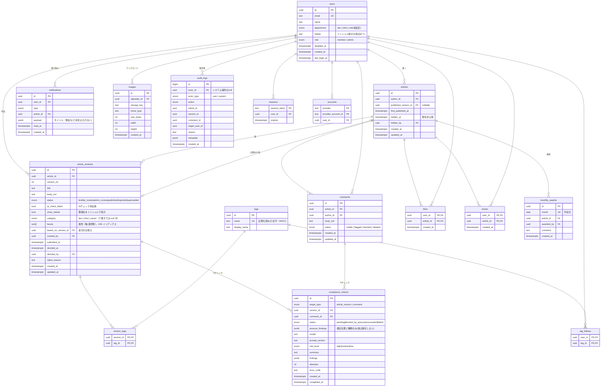

# DB 設計

## 考え方

- **記事（articles）と版（article_versions）を分ける**。記事は「公開中の版」と「作業中の版」を
  指すだけで、本文は版に持つ
  - 公開中の版：`articles.published_version_id`
  - 進行中の版（draft / ai_review / admin_review）：1 記事につき最大 1 つ（部分ユニークインデックス）
  - 著者に見せる「作業中の版」は最新の版（版番号が最大）。それが draft / ai_review / admin_review /
    rejected なら作業中とする。rejected は終わりの状態で、修正すると新しい draft 版を作る
  - これにより「公開後に編集 → 審査中も旧版を表示し続ける」が自然に実現できる
- 審査に出した版は**不変**。rejected の版を著者が修正すると、新しい draft 版を作る
  （差し戻された版の内容が監査用にそのまま残る）
- 緊急非公開は版の状態ではなく、記事側のフラグ（`hidden_at`）で表す。公開中の版はそのまま残す
- 監査ログは追記のみ（アプリ用 DB ロールは INSERT / SELECT のみ、UPDATE / DELETE はトリガーで拒否）

## ER 図



`sessions` / `accounts` は Auth.js の Prisma アダプタが要求するテーブル。

## テーブル定義の補足

### article_versions.status
| 値 | 意味 |
|---|---|
| draft | 著者が編集中。本人だけが見られる。自動保存の対象 |
| ai_review | 審査申請済み。AI チェック待ち・実行中 |
| admin_review | 管理者の判断待ち |
| published | 公開中（`articles.published_version_id` が指す版） |
| rejected | 差し戻し。著者が修正すると新しい draft 版を作る |
| superseded | かつて公開されていたが、新しい版の公開で置き換わった |

### audit_logs.action
`version_created` / `draft_discarded` / `submitted` / `prescan_blocked` / `ai_check_completed` / `ai_check_failed` /
`auto_rejected` / `approved` / `rejected` / `article_hidden` / `article_unhidden` /
`comment_blocked` / `comment_flagged` / `comment_deleted` / `role_changed` / `user_disabled` /
`user_enabled` / `award_given`（フェーズごとに Prisma の enum に追加する）

- AI の判定結果（モデル名、プロンプトのバージョン、risk_level、findings）は
  `compliance_checks` に保存し、監査ログの `metadata` にも同じ内容を複製する
  （`compliance_checks` は再試行の途中経過で更新されるため、確定値は監査ログ側を正とする）
- `prescan_findings` には「何行目に・どの種類の秘密情報らしき文字列があったか」だけを保存し、
  一致した値そのものは保存しない
- 監査ログの `metadata` に記事本文は入れない（本文は版テーブルにあるので ID で参照する）

## 主要なインデックス

| テーブル | インデックス | 用途 |
|---|---|---|
| users | `UNIQUE (email)` | ログイン時の照合 |
| articles | `(first_published_at DESC) WHERE published_version_id IS NOT NULL AND hidden_at IS NULL` | 新着一覧 |
| articles | `(author_id, updated_at DESC)` | マイページ・ユーザーページ |
| article_versions | `UNIQUE (article_id, version_no)` | 版番号 |
| article_versions | `UNIQUE (article_id) WHERE status IN ('draft','ai_review','admin_review')` | 進行中の版は 1 記事 1 つ（差し戻された版は含めない） |
| article_versions | `(submitted_at) WHERE status = 'admin_review'` | レビュー待ち一覧（申請日時順） |
| article_versions | `GIN (lower(title) gin_bigm_ops)`、`GIN (lower(body_md) gin_bigm_ops)` | 日本語全文検索（公開版を join して絞る）。pg_bigm は LIKE にしか効かないため、英字の大文字・小文字を区別しないよう `lower()` の式インデックスにする |
| tags | `UNIQUE (name)`、`GIN (name gin_bigm_ops)` | タグ候補の部分一致 |
| version_tags | `(tag_id, version_id)` | タグ別一覧 |
| likes / stocks | PK `(user_id, article_id)` + `(article_id, created_at)` | 重複防止、週間・月間集計 |
| comments | `(article_id, created_at)` | 記事のコメント表示 |
| comments | `(status) WHERE status = 'flagged'` | 管理者の要確認一覧 |
| notifications | `(user_id, created_at DESC) WHERE read_at IS NULL` | 未読通知 |
| compliance_checks | `(version_id, created_at DESC)`、`(comment_id)` | 最新の判定取得 |
| audit_logs | `(article_id, created_at)`、`(actor_id, created_at)`、`(action, created_at)` | 記事ごとの履歴、操作者ごとの履歴、集計 |
| monthly_awards | `UNIQUE (month)` | 月 1 本の表彰 |

## 監査ログの保護（マイグレーションで作る）

```sql
-- アプリ用ロールは追記と参照のみ
REVOKE UPDATE, DELETE, TRUNCATE ON audit_logs FROM app_user;
GRANT INSERT, SELECT ON audit_logs TO app_user;

-- 権限設定のミスに備えてトリガーでも拒否
CREATE FUNCTION audit_logs_block_modify() RETURNS trigger AS $$
BEGIN RAISE EXCEPTION 'audit_logs is append-only'; END;
$$ LANGUAGE plpgsql;
CREATE TRIGGER audit_logs_no_update BEFORE UPDATE OR DELETE ON audit_logs
  FOR EACH ROW EXECUTE FUNCTION audit_logs_block_modify();
```

マイグレーションはオーナーロール、アプリの実行は `app_user` ロールと、接続ユーザーを分ける。

## 版の保護（マイグレーションで作る）

アプリにバグがあっても承認フローを迂回できないよう、`article_versions` にトリガーを付ける。

- 新しい版はかならず `draft` で作る（INSERT 時に確認）
- 状態は `docs/design/workflow.md` の遷移だけを許す（`draft → published` などの飛び越しは拒否）
- 審査に出した版（`draft` 以外）は、タイトル・本文・タグ・イニシャル表示・大分類・属性を変更できず、削除もできない
