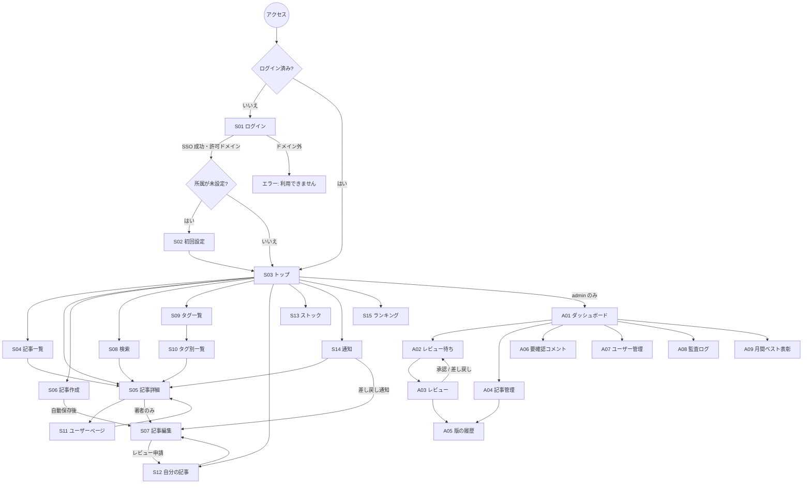

# 画面一覧と画面遷移

すべての画面はログイン必須（`/login` とエラー画面を除く）。

- メニュー：PC では右のサイドバー、スマホではヘッダー右端のボタンから右側に開くドロワー（右利きの人が多いため右側に置く）（`src/components/layout/side-nav.tsx`）
- イニシャル投稿：記事ごとに著者名をイニシャルで表示できる。ほかの人に返すデータには実名・ユーザー ID を含めない。
  管理者のレビュー画面・版の履歴・監査ログには実名を出す（責任の所在のため）

## 画面一覧

### 一般（member / admin）

| ID | パス | 画面 | 主な内容 | フェーズ |
|---|---|---|---|---|
| S01 | `/login` | ログイン | 社内 SSO ボタンのみ | 1 |
| S02 | `/onboarding` | 初回設定 | 所属（開発部／インフラ部）の選択 | 1 |
| S03 | `/` | トップ | 新着、週間トレンド、部署別の新着、フォロー中タグのフィード、月間ベストのバッジ | 2（簡易）→ 5 |
| S04 | `/articles` | 記事一覧 | 新着順。大分類のタブと、軸ごとの属性で絞り込み（docs/design/taxonomy.md） | 2 |
| S05 | `/articles/[id]` | 記事詳細 | 公開中の版、いいね・ストック・コメント。著者には作業中の版の状態を表示 | 2 → 5 |
| S06 | `/articles/new` | 記事作成 | Markdown エディタ（左入力・右プレビュー）、大分類と属性、テンプレート挿入、タグ、画像貼り付け、自動保存 | 2 |
| S07 | `/articles/[id]/edit` | 記事編集 | S06 と同じ。審査状況、AI の指摘、差し戻し理由を表示。「レビュー申請」ボタン | 2 → 3 |
| S08 | `/search?q=` | 検索結果 | タイトル・本文・タグの全文検索 | 2 |
| S09 | `/tags` | タグ一覧 | 記事数順。フォローボタン | 2 → 5 |
| S10 | `/tags/[name]` | タグ別一覧 | タグの記事一覧、フォロー | 2 → 5 |
| S11 | `/users/[id]` | ユーザーページ | 投稿記事、いいね数の合計、所属部署 | 5 |
| S12 | `/me/articles` | 自分の記事 | 下書き・審査中・差し戻し・公開中をタブで表示 | 2 → 3 |
| S13 | `/me/stocks` | ストック一覧 | | 5 |
| S14 | `/notifications` | 通知 | 承認・差し戻し（理由付き）・いいね・コメント | 6 |
| S15 | `/rankings` | 月間ランキング | 記事ランキング、投稿者ランキング | 6 |
| S16 | `/me/settings` | 設定 | 所属部署、イニシャル（イニシャル表示で投稿するときの表記） | 3 |

### 管理者（admin のみ）

| ID | パス | 画面 | 主な内容 | フェーズ |
|---|---|---|---|---|
| A01 | `/admin` | ダッシュボード | 月別・部署別の投稿数、レビュー平均時間、AI 差し戻し率 | 6 |
| A02 | `/admin/reviews` | レビュー待ち一覧 | 申請日時順。AI リスクレベル、「AI チェック未実施」の警告 | 3 → 4 |
| A03 | `/admin/reviews/[versionId]` | レビュー | 本文（指摘箇所ハイライト）、AI の指摘と事前スキャンの警告、前回版との差分、承認／差し戻し（理由必須） | 3 → 4 |
| A04 | `/admin/articles` | 記事管理 | 全記事の状態、緊急非公開／再公開（理由必須） | 3 |
| A05 | `/admin/articles/[id]/versions` | 版の履歴 | 過去の版と差分、各版の AI 判定と審査履歴 | 3 |
| A06 | `/admin/comments` | 要確認コメント | AI で medium と判定されたコメント、削除 | 5 |
| A07 | `/admin/users` | ユーザー管理 | ロール変更（admin 昇格・降格）、無効化 | 1 |
| A08 | `/admin/audit-logs` | 監査ログ | 記事・操作者・操作種別・期間で絞り込み（閲覧のみ） | 3 |
| A09 | `/admin/awards` | 月間ベスト表彰 | ランキングから記事を選んで表彰 | 6 |

## 画面遷移

