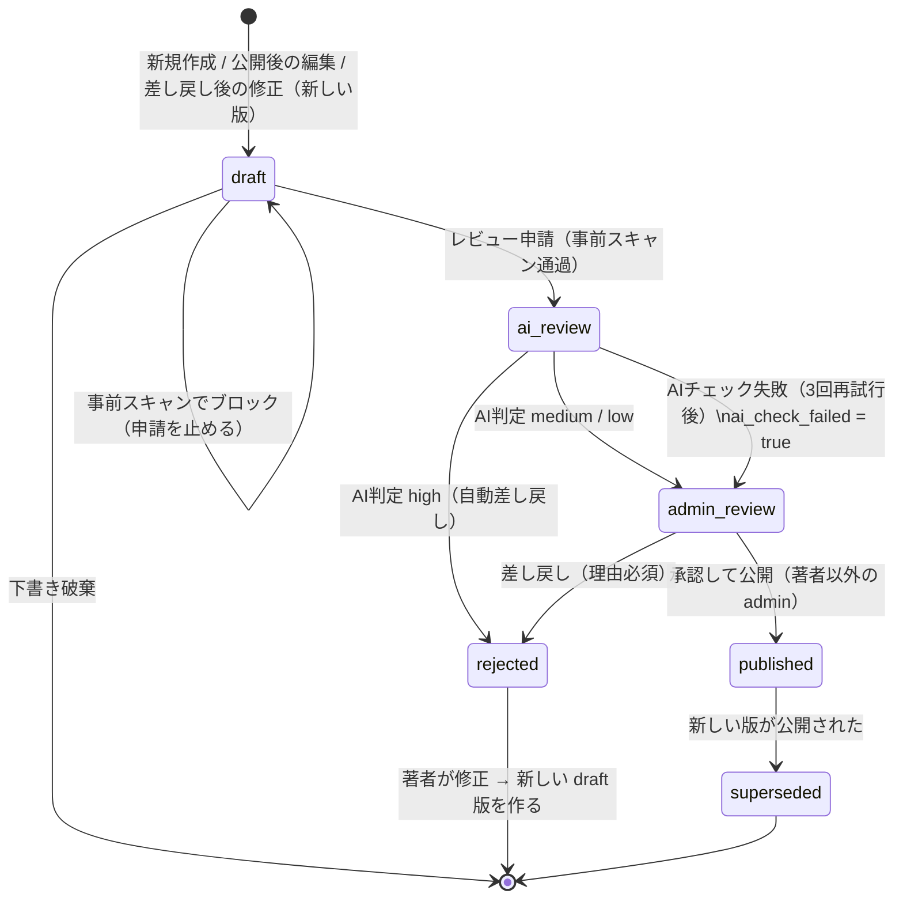
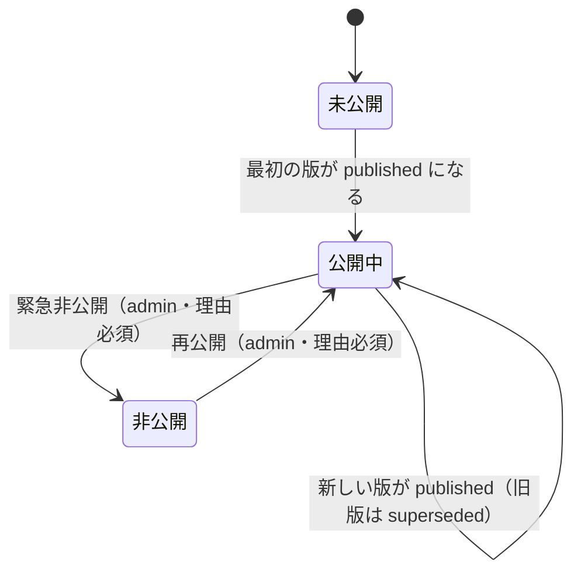

# 記事の状態遷移

## 版（article_versions）の状態遷移図

## 記事（articles）側の表示状態

- 公開中の記事を編集しても、新しい版の審査が終わるまで `published_version_id` は旧版のまま
- 緊急非公開中でも、著者は新しい版を作って審査に出せる（承認されても `hidden_at` が
  解除されるまでは表示されない）

## 遷移とロールの対応表

| # | 遷移 | 実行者 | 条件・副作用 | 監査ログ |
|---|---|---|---|---|
| 1 | （なし）→ draft | 著者（member / admin） | 新規作成 | version_created |
| 2 | published → 新しい draft 版 | 著者 | 作業中の版がないこと。公開中の版を複製 | version_created |
| 3 | rejected → 新しい draft 版 | 著者 | 差し戻された版を複製（差し戻された版は残る） | version_created |
| 4 | draft → draft（編集） | 著者 | 本人のみ。審査中の版は編集不可 | 記録しない（自動保存のため） |
| 5 | draft → ai_review | 著者 | 事前スキャンで「ブロック対象」がないこと。タイトル・本文が空でないこと | submitted |
| 5' | draft のまま（申請拒否） | システム | 事前スキャンでブロック対象を検出。該当箇所を著者に表示 | prescan_blocked |
| 6 | ai_review → admin_review | システム | AI 判定 medium / low | ai_check_completed |
| 7 | ai_review → admin_review | システム | 3 回失敗。`ai_check_failed = true`、管理者に警告 | ai_check_failed |
| 8 | ai_review → rejected | システム | AI 判定 high。指摘と修正案を著者に表示 | ai_check_completed, auto_rejected |
| 9 | admin_review → published | admin（著者本人を除く） | 旧公開版を superseded に、`published_version_id` を更新 | approved |
| 10 | admin_review → rejected | admin（著者本人を除く） | 理由必須 | rejected（理由付き） |
| 11 | 記事を緊急非公開 | admin | 理由必須。著者本人の admin も実行可（安全側の操作のため） | article_hidden |
| 12 | 記事を再公開 | admin（著者本人を除く） | 理由必須 | article_unhidden |
| 13 | draft を破棄 | 著者 | 一度も公開されていない記事なら記事ごと削除 | 記録する（版の作成ログと対応させるため） |

- **member / admin の違いは「管理者として承認できるか」だけ**。記事を書く権限は同じ
- 上記以外の遷移（例：draft → published、ai_review → published、rejected → admin_review）は
  すべてステートマシンがエラーにする。DB のトリガーでも同じ遷移だけを許す（docs/design/database.md）
- 実装：`src/server/workflow/`（遷移表は `transitions.ts`）。画面からは `src/server/workflow/actions.ts`
  の Server Action を呼ぶ
- 差し戻された版（rejected）は終わりの状態。著者が修正すると新しい draft 版を作り（比較元は差し戻された版）、
  レビュー画面では「前回差し戻した版からの修正」として差分を表示する
- フェーズ 3 の AI チェックは仮実装（`runComplianceCheck` が判定なしで admin_review へ進める）
- 遷移は「現在の状態を条件にした UPDATE」（`WHERE id = ? AND status = ?`）で行い、
  同時に 2 人の管理者が操作しても二重に処理されないようにする
- AI チェックの結果が返ってきたときに、すでに別の版に置き換わっていたら結果は保存するが
  遷移はしない

## 閲覧権限

| 対象 | 著者 | 他の member | admin |
|---|---|---|---|
| 公開中の版（非公開でない） | ○ | ○ | ○ |
| 自分の作業中の版・AI の指摘 | ○ | × | ○（ai_review 以降のみ） |
| 他人の draft | — | × | ×（審査に出るまでは本人だけ） |
| 過去の版・差分 | ○（自分の記事） | × | ○ |
| 緊急非公開中の記事 | ○（理由も表示） | × | ○ |
| 監査ログ | × | × | ○ |
